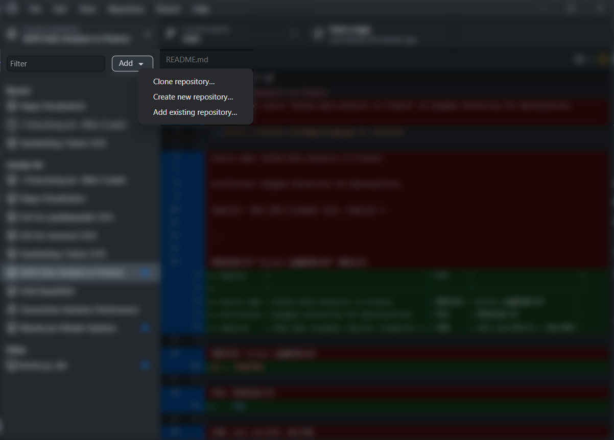
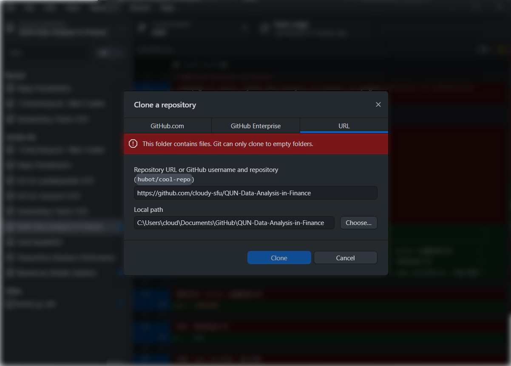
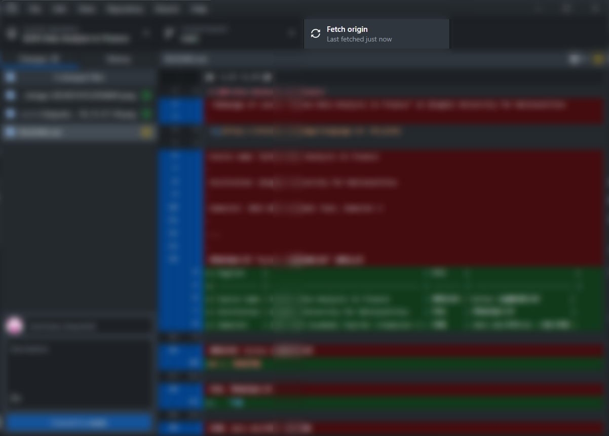

# QUN-Data-Analysis-in-Finance

| English     |                                         | 中文     |                            |
| ----------- | --------------------------------------- | -------- | -------------------------- |
| Course name | Python Data Analysis in Finance         | 课程名称 | Python 金融数据分析        |
| Institution | Qinghai University for Nationalities    | 学校     | 青海民族大学               |
| Semester    | 2022-2023 Academic Year Semester 2 | 学期     | 2022-2023学年 第2学期 |

## 1. 快速开始

1.   下载 [GitHub Desktop](https://desktop.github.com/) 并安装。
2.   点击 `Add | Clone repository ...` 按钮。 
     
3.   键入地址 https://github.com/cloudy-sfu/QUN-Data-Analysis-in-Finance 同步到本地。 
     
4.   定期点击 `Fetch origin` 同步更新，即可增量同步课程的更新内容。 
     
5.   如果不能访问 https://github.com/ 请与课代表联系。课代表将在 https://gitee.com/ 上运行一个中国镜像，定期更新课件。

